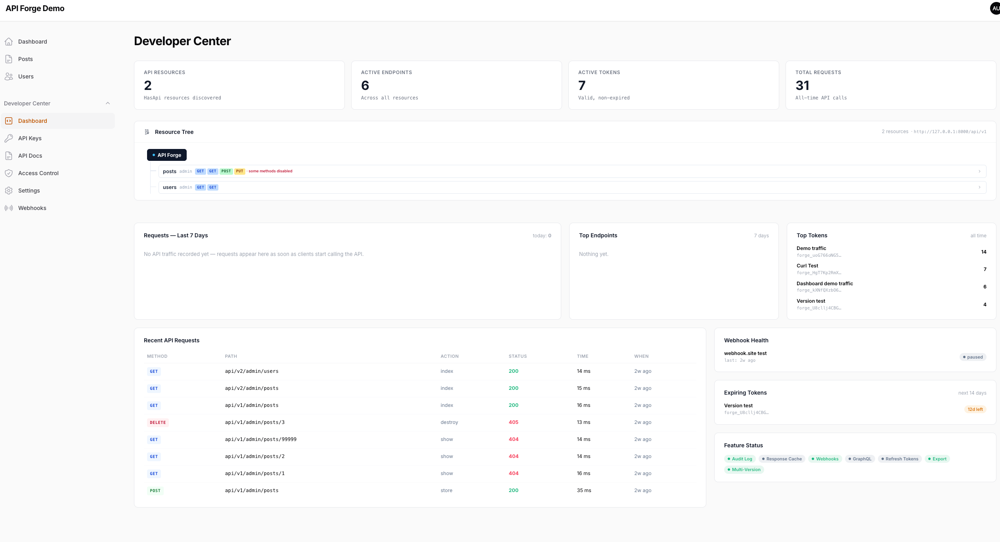
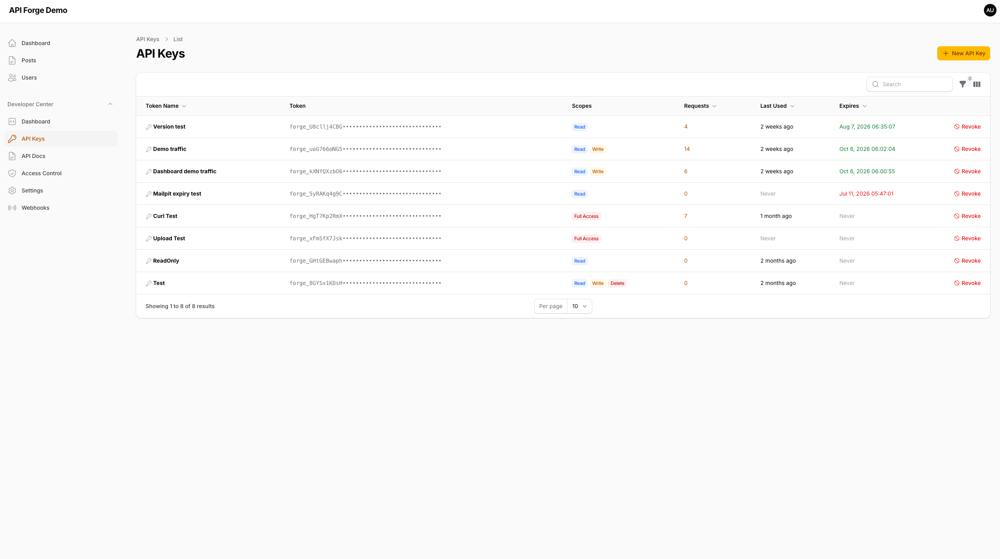
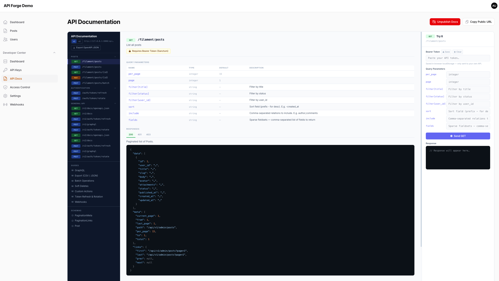
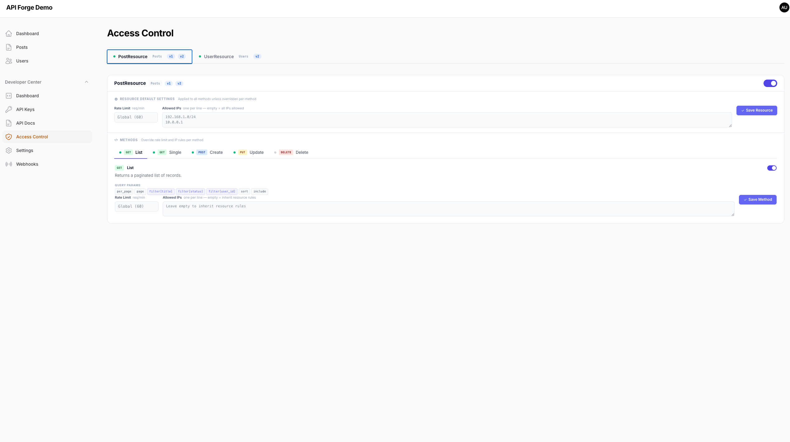
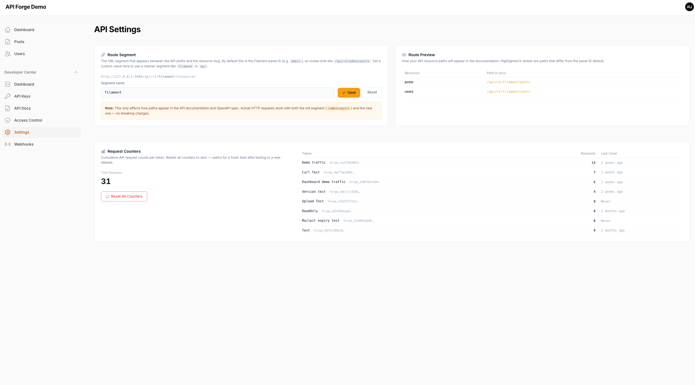
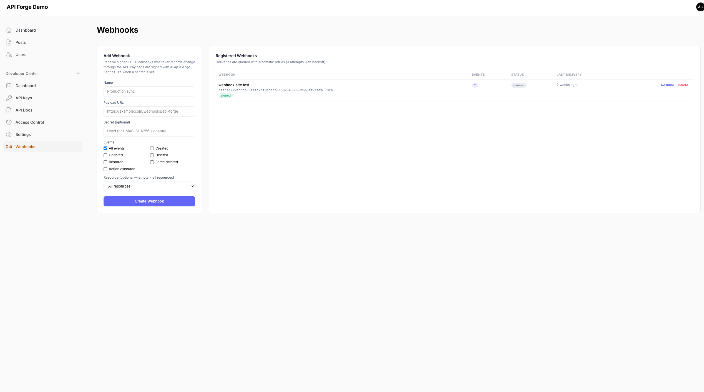
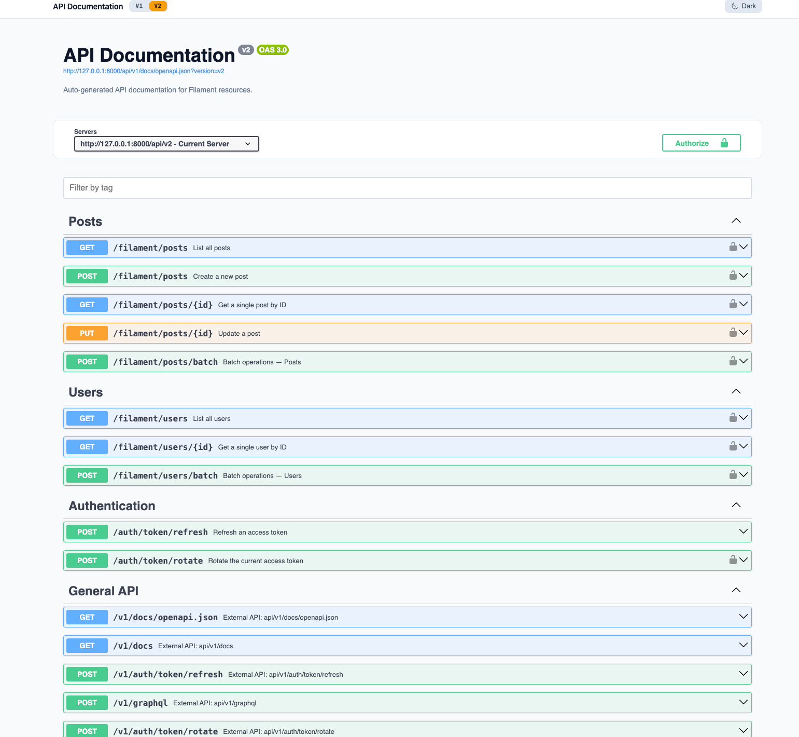

# Filament API Forge

Automatically turn your Filament Resources into fully-featured, secure, and documented REST and GraphQL APIs with zero route boilerplate.

[](https://packagist.org/packages/yusufgenc/filament-api-forge)
[](https://www.php.net)
[](https://filamentphp.com)
[](LICENSE)

---

## Screenshots

| Developer Center | API Keys |
|---|---|
|  |  |

| Interactive OpenAPI Docs | Access Control |
|---|---|
|  |  |

| Settings | Webhooks |
|---|---|
|  |  |

| Public Documentation |
|---|
|  |

---

## Overview

Building APIs for Laravel apps often requires writing redundant controllers, form requests, policies, and Swagger documentation for every model. **Filament API Forge** eliminates this boilerplate by extending Filament's Server-Driven UI concept straight to your API layer.

Simply implement `HasApi` on any Filament Resource and get an instant REST (and optional GraphQL) API with token authentication, rate limiting, IP protection, policy enforcement, and live Swagger documentation.

---

## Features

| Feature | Description | Reference |
|---------|-------------|-----------|
| **Auto-Discovery** | Detects resources implementing `HasApi` with zero route registration | [Exposing Resources](DOCS.md#3-exposing-resources) |
| **Hash-Based Auth** | `forge_` tokens hashed at rest (SHA-256) — no Sanctum required | [Authentication](DOCS.md#4-authentication--security) |
| **Policy Authorization** | Automatic Laravel Model Policy integration (`Gate::authorize`) | [Policies](DOCS.md#5-policy-authorization) |
| **Spatie Query Builder** | Filtering, sorting, sparse fieldsets, relation includes out of the box | [Query Building](DOCS.md#6-rest-api-endpoints--query-building) |
| **Custom Eloquent Resources** | Use custom `JsonResource` classes per resource | [Custom Formatting](DOCS.md#7-custom-response-formatting) |
| **Relation Syncing** | Auto-sync `BelongsToMany` and `MorphToMany` relations on write | [Relation Syncing](DOCS.md#8-relationship-syncing) |
| **Batch Operations** | Bulk `create`, `update`, `delete`, `restore`, and `forceDelete` in one request | [Batch Operations](DOCS.md#13-batch-operations) |
| **File Uploads** | Multipart form data uploads for Filesystem & Spatie Media Library | [File Uploads](DOCS.md#10-file-uploads) |
| **OpenAPI & Public Docs** | Auto-generated OpenAPI 3.0 specs with interactive Swagger UI | [Documentation](DOCS.md#20-developer-center-panel-pages) |
| **Developer Center** | Panel pages for API Key Management, Settings, Logs & Access Control | [Panel Pages](DOCS.md#20-developer-center-panel-pages) |

---

## Quick Start

### 1. Install via Composer
```bash
composer require yusufgenc/filament-api-forge
php artisan vendor:publish --tag="filament-api-forge-migrations"
php artisan migrate
```

### 2. Register Plugin in your Panel Provider
```php
use YusufGenc34\FilamentApiForge\FilamentApiForgePlugin;

public function panel(Panel $panel): Panel
{
    return $panel
        ->plugin(FilamentApiForgePlugin::make());
}
```

### 3. Expose a Resource
Implement `HasApi` on your Filament Resource and add `apiConfig()`:

```php
use YusufGenc34\FilamentApiForge\Contracts\HasApi;

class PostResource extends Resource implements HasApi
{
    public static function apiConfig(): array
    {
        return [
            'allowed_methods'  => ['index', 'show', 'store', 'update', 'destroy'],
            'allowed_filters'  => ['title', 'status'],
            'allowed_sorts'    => ['created_at'],
            'use_policies'     => true,
            'validation_rules' => [
                'title' => ['required', 'string', 'max:255'],
            ],
        ];
    }
}
```

Your API endpoint is ready at `/api/v1/admin/posts`.

---

## Documentation

For comprehensive documentation covering Hooks, Uploads, Custom Actions, Nested Resources, GraphQL, Webhooks, Multi-Tenancy, and API Versioning, see [DOCS.md](DOCS.md).

## Contributing

Contributions are welcome! Whether it is fixing a bug, improving documentation, or proposing a new feature, your help is appreciated.

### Development Setup

1. Fork and clone the repository.
2. Install dependencies:
   ```bash
   composer install
   ```
3. Run the test suite:
   ```bash
   ./vendor/bin/pest
   ```
4. Format code style before submitting a pull request:
   ```bash
   vendor/bin/pint
   ```

Please ensure all tests pass and new features include test coverage.

---

## Security Vulnerabilities

If you discover a security vulnerability within Filament API Forge, please send an issue or email to the maintainers. All security vulnerabilities will be promptly addressed.

---

## Support & Credits

If you find this package useful, please consider giving it a star on GitHub to support its development!

Created and maintained by [Yusuf Genc](https://github.com/YusufGenc34).

---

## License

The MIT License (MIT). Please see [License File](LICENSE) for more information.
